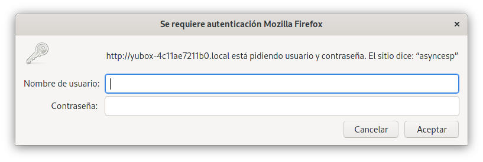
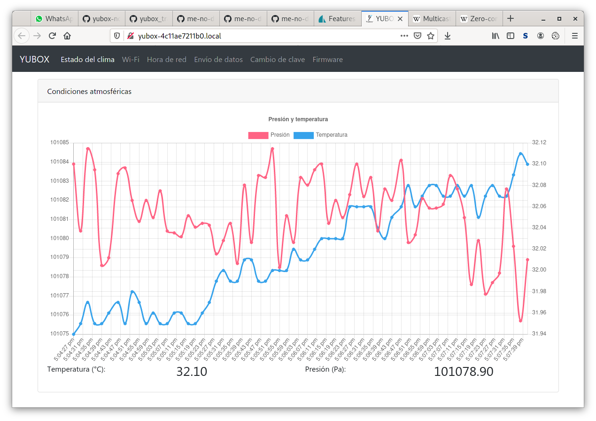

# YUBOX Framework
Librería que consolida varias necesidades comunes a todos los proyectos basados en YUBOX ESP32 para IoT.

## Tabla de contenido
- [YUBOX Framework](#yubox-framework)
  - [Tabla de contenido](#tabla-de-contenido)
  - [Requerimientos del framework](#requerimientos-del-framework)
  - [Instalación](#instalación)
    - [Requisitos en PC de desarrollo](#requisitos-en-pc-de-desarrollo)
    - [Dependencias Arduino](#dependencias-arduino)
    - [Obtener biblioteca](#obtener-biblioteca)
  - [Modelo de funcionamiento](#modelo-de-funcionamiento)
  - [Estructura de directorios](#estructura-de-directorios)
  - [Creación de un nuevo proyecto](#creación-de-un-nuevo-proyecto)
    - [Archivos y directorios de proyecto](#archivos-y-directorios-de-proyecto)
    - [Desarrollo cliente - JavaScript](#desarrollo-cliente---javascript)
    - [Desarrollo server - Arduino C++](#desarrollo-server---arduino-c)
    - [Transferencia de sketch al ESP32](#transferencia-de-sketch-al-ESP32)
  - [Configuración básica usando interfaz web](#configuración-básica-usando-interfaz-web)
    - [Ingreso a red softAP y configuración WiFi](#ingreso-a-red-softap-y-configuración-wifi)
    - [Credenciales y cambio de clave](#credenciales-y-cambio-de-clave)
    - [Configuración NTP](#configuración-ntp)
    - [Actualización de firmware](#actualización-de-firmware)
    - [Configuración MQTT (según proyecto)](#configuración-mqtt-según-proyecto)

## Requerimientos del framework

A partir de la historia de proyectos de IoT de [YUBOX](https://yubox.com/) se ha notado que las implementaciones
entregadas a los clientes tienen características en común que fue necesario implementar, o que hubiese sido
de mucha ayuda haber llegado a implementar. Una lista, no exhaustiva, de tales características se muestra
a continuación:
- Configuración del dispositivo a través de una interfaz Web
- Protección contra acceso no autorizado a la configuración del dispositivo mediante contraseña
- Almacenamiento de configuración en NVRAM en oposición a valores incrustados en el código fuente
- Descubrimiento y configuración in situ de redes WiFi para conectividad a Internet. Esto necesariamente implica
  el uso de la interfaz softAP del ESP32 para tener acceso al dispositivo antes de configurar credenciales
  WiFi.
- Configuración de servidor de hora (NTP) personalizado dentro de redes aisladas del exterior
- Descubrimiento de la existencia del dispositivo en una red local
- Configuración estandar de acceso a un servidor MQTT
- Actualización OTA (Over The Air) del firmware del dispositivo con uso del rollback disponible en el ESP32

La biblioteca de YUBOX Framework es un proyecto en desarrollo que implementa las funcionalidades descritas arriba
y presenta una interfaz web estandarizada usando [Bootstrap 4](https://getbootstrap.com/) para disponer de widgets
estándar. Se debe hacer notar que la porción C++ que se ejecuta en el ESP32 usa AJAX para su comunicación y no
depende estrictamente de Bootstrap. Sin embargo, cualquier intento de migrar la interfaz para usar otra biblioteca
de interfaz web cliente, requiere una reescritura de todas las porciones HTML y Javascript del framework, y está
más allá del alcance de esta documentación.

## Instalación

Para poder construir un proyecto que use el Yubox Framework, se debe preparar la PC de desarrollo con los requisitos
descritos a continuación:

### Requisitos en PC de desarrollo

Esta guía ha sido construida desde el punto de vista de un desarrollo en una PC con una distro Linux. Consecuentemente
todos los comandos y utilidades indicados a continuación son presentados como los ejecutaría un usuario de Linux. El
desarrollo con YUBOX Framework en un sistema operativo distinto (MacOS o Windows) puede requerir pasos adicionales.
Además se asume que el usuario Linux tiene conocimiento de línea de comando básica (shell), y que tiene permisos para
instalar paquetes adicionales en caso necesario, tanto localmente como a nivel global del sistema.

Se requieren los siguientes paquetes y componentes en la PC de desarrollo:
- Arduino IDE, en su versión 1.8 o superior. No está soportado el desarrollo usando versiones anteriores de Arduino IDE.
  En particular, las distros basadas en Ubuntu podrían tener un paquete arduino que es una versión muy vieja para
  funcionar correctamente con el resto de paquetes. Si la versión instalada es muy vieja, debe actualizarse con una
  versión más reciente instalada desde el zip o targz oficial de [Arduino](https://www.arduino.cc/en/Main/Software).

  *ATENCIÓN*: algunas distros ofrecen la instalación de Arduino a través de Flatpak. Sin embargo, el modelo de ejecución
  de Flatpak puede obstruir el acceso a los puertos seriales y también negar el acceso al intérprete Python del sistema
  lo cual impide completamente subir programas al ESP32. Se recomienda no instalar el Arduino IDE desde Flatpak, sino
  usando el zip o targz oficial, o el paquete ofrecido por los repositorios de la distro (si es lo suficientemente
  reciente).
- Soporte de ESP32 para el Arduino IDE. Para instalar este soporte, ejecute el Arduino IDE, elija del menú la opción
  Archivo-->Preferencias, y en el cuadro de diálogo inserte o agregue en la caja de texto "Gestor de URLs Adicionales
  de Tarjetas" la siguiente URL: https://dl.espressif.com/dl/package_esp32_index.json .

  *NOTA*: Si no aparece la caja de texto para URLs de tarjetas, su versión de Arduino IDE podría ser muy vieja. Revise la
  versión de su IDE y actualice en caso necesario.

  A continuación pulse el botón OK, reinicie el Arduino IDE, y elija la opción de menú Herramientas-->Placa-->Gestor
  de tarjetas. Entonces debe mostrarse un diálogo donde se carga la lista de soportes de tarjetas, incluyendo el soporte
  "esp32". Pulse sobre esa fila el botón "Instalar", y deje que todos los componentes se descarguen. Luego de completar
  la instalación, reinicie el Arduino IDE, y elija las siguientes opciones de tarjeta en el menú Herramientas. Note que
  el orden de elección es importante, porque el tipo de tarjeta condiciona la aparición de las siguientes opciones:
  - Herramientas-->Placa-->ESP32 Arduino-->NodeMCU-32S
  - Herramientas-->Upload Speed-->921600
  - Herramientas-->Flash Frequency-->80MHz

  Al llegar a este punto, recomendamos que verifique que su Arduino IDE efectivamente puede compilar y enviar un sketch
  mínimo a su YUBOX Node a través del puerto USB Serial, y que el sketch efectivamente se ejecute correctamente.
- Comando `make` instalado correctamente en su sistema. Si el comando `make` no está instalado, es probable que se lo
  pueda instalar con un comando similar a `sudo apt-get install make` (para distros basadas en Debian o Ubunto), o
  `sudo yum install make` o `sudo dnf install make` para distros basadas en RedHat como CentOS, SuSE o Fedora. Otras
  distros pueden requerir sus propias herramientas de instalación de paquetes.
- Intérprete `python3`. Se requiere Python 3 para el comando `yubox-framework-assemble`, el cual no ha sido diseñado para
  ser ejecutado en Python2. En Fedora 32 el intérprete Python por omisión es Python 3.8. En otras distros puede que sea
  necesario instalar explícitamente Python3 con el comando `sudo apt-get install python3` o `sudo yum install python3`
  o `sudo dnf install python3` según su distro.
- Paquete `pip3` que provee [Pip](https://pypi.org/project/pip/) para Python 3. Este paquete puede que sea necesario si
  los paquetes de Python 3 indicados a continuación no están disponibles como paquetes de su distro. Primero verifique
  si existe el comando `/usr/bin/pip3`. Si el comando no existe, instálelo con `sudo apt-get install python3-pip`,
  `sudo yum install python3-pip`, o `sudo dnf install python3-pip` según su distro de Linux.
- El comando `yubox-framework-assemble` requiere además de los siguientes paquetes. Para cada uno, intente primero
  instalar una versión provista por el repositorio de su distro Linux. Si la distro no provee el paquete, entonces ejecute
  el comando `pip3 install PAQUETE` donde PAQUETE debe reemplazarse por el paquete a instalar:
  - `pystache`, intérprete de plantillas [Mustache](http://mustache.github.io/) para Python, posiblemente disponible como `python3-pystache`.

### Dependencias Arduino

Se requieren las siguientes bibliotecas de código como dependencias de YUBOX Framework:
- `ArduinoJSON` que es una biblioteca para serializar y deserializar JSON, para Arduino. Esta biblioteca se usa
  principalmente para construir respuestas JSON a las peticiones AJAX. Esta biblioteca se la puede instalar desde el
  gestor de bibliotecas del Arduino IDE. El YUBOX Framework ha sido probado con la versión 6.15.2 al 22 de julio de
  2020.
- `AsyncTCPSock` que es una biblioteca para realizar conexiones TCP/IP de forma asíncrona en una tarea separada del ESP32.
  Esta biblioteca es una reimplementación de la biblioteca `AsyncTCP` [AsyncTCP](https://github.com/me-no-dev/AsyncTCP),
  hecha para resolver una falla de diseño discutida [aquí](https://github.com/me-no-dev/ESPAsyncWebServer/issues/825#issuecomment-680291383)
  la cual consiste en un bloqueo mutuo (deadlock) que arriesga reinicios anormales en
  escenarios de alta actividad de red. La biblioteca `AsyncTCPSock` **NO** está disponible en el gestor de bibliotecas
  de Arduino IDE. Para instalarla, visite https://github.com/yubox-node-org/AsyncTCPSock y descargue un zip con el código
  fuente desde https://github.com/yubox-node-org/AsyncTCPSock/archive/master.zip o (para uso avanzado) haga un checkout
  usando `git`. En cualquier caso, debe existir un directorio con el código de la biblioteca debajo de
  `$(HOME)/Arduino/libraries` . Por ejemplo, `/home/fulano/Arduino/libraries/AsyncTCPSock`. Esta biblioteca es un requisito
  para las dos bibliotecas siguientes.
  - **NOTA**: en una versión anterior de este documento, se recomendaba la instalación de `AsyncTCP` antes de diagnosticar
    el escenario de deadlock que condujo al desarrollo de `AsyncTCPSock`. La biblioteca `AsyncTCPSock` es deliberadamente
    incompatible con `AsyncTCP` ya que reimplementa el mismo API. Por lo tanto, ambas bibliotecas **NO** deben estar
    instaladas simultáneamente en la misma instalación de Arduino IDE. Si se va a instalar `AsyncTCPSock`, se debe
    también quitar `AsyncTCP` para poder usar la versión correcta.
- `ESPAsyncWebServer` que es una biblioteca para exponer un servidor web en el ESP32, usando `AsyncTCP` o `AsyncTCPSock`.
  Para proyectos nuevos usando YUBOX-Now, se recomienda usar el fork disponible en https://github.com/yubox-node-org/ESPAsyncWebServer
  el cual apunta a la rama (por omisión) llamada `yuboxfixes-0xFEEDC0DE64-cleanup`. Visite el enlace indicado y descargue
  un zip con el código fuente desde https://github.com/yubox-node-org/ESPAsyncWebServer/archive/refs/heads/yuboxfixes-0xFEEDC0DE64-cleanup.zip .
  Debe existir eventualmente un directorio con el código debajo de `$(HOME)/Arduino/libraries` . Por ejemplo,
  `/home/fulano/Arduino/libraries/ESPAsyncWebServer`.
  - **NOTA**: en una versión anterior de este documento, se recomendaba la instalación de la versión base de
    `ESPAsyncWebServer`. El fork indicado más arriba contiene correcciones de fugas de memoria y otras condiciones
    de carrera que han sido corregidas por YUBOX al usar la biblioteca en nuestros proyectos.
- `Async MQTT client for ESP8266 and ESP32` que es una biblioteca para un cliente MQTT, construida sobre `AsyncTCP`.
  Para instalar esta biblioteca, visite https://github.com/marvinroger/async-mqtt-client y descargue un zip con el código
  fuente desde https://github.com/marvinroger/async-mqtt-client/archive/master.zip . Debe existir eventualmente un
  directorio con el código debajo de `$(HOME)/Arduino/libraries` . Por ejemplo, `/home/fulano/Arduino/libraries/async-mqtt-client`.

Además se recomienda instalar el siguiente addon de Arduino IDE:
- [Arduino ESP32 filesystem uploader](https://github.com/me-no-dev/arduino-esp32fs-plugin), el cual es un addon al Arduino
  IDE que permite poblar la partición SPIFFS del ESP32 con archivos preparados desde un directorio del proyecto. Visite
  https://github.com/me-no-dev/arduino-esp32fs-plugin y siga las instrucciones para instalar el plugin.

### Obtener biblioteca

Para instalar el YUBOX Framework, visite https://github.com/yubox-node-org/yubox-framework y descargue un zip con el código
fuente desde https://github.com/yubox-node-org/yubox-framework/archive/master.zip . Debe existir eventualmente un directorio
con el código debajo de `$(HOME)/Arduino/libraries` . Por ejemplo, `/home/fulano/Arduino/libraries/yubox-framework`.

En este punto, verifique si se puede ejecutar correctamente el programa `yubox-framework-assemble` ejecutando lo siguiente en
una consola de línea de comando:

```
$ chmod +x ~/Arduino/libraries/yubox-framework/yubox-framework-assemble
$ ~/Arduino/libraries/yubox-framework/yubox-framework-assemble
```

Si se han instalado todos los requisitos, la salida debería ser la siguiente línea:

```
Uso: /home/alex/Arduino/libraries/yubox-framework/yubox-framework-assemble /data/template/dir1:/data/template/dir2:(...) module1 (module2 ...)
```

Si en su lugar se muestra un mensaje aludiendo a python3 inexistente, como el siguiente:

```
bash: /home/alex/Arduino/libraries/yubox-framework/yubox-framework-assemble: /usr/bin/python3: intérprete erróneo: No existe el fichero o el directorio
```
Verifique que se dispone de Python 3 en su sistema.

Si en su lugar se muestra un mensaje que contiene mención de ModuleNotFoundError, como el siguiente:

```
Traceback (most recent call last):
  File "/home/alex/Arduino/libraries/yubox-framework/yubox-framework-assemble", line 9, in <module>
    import pystache
ModuleNotFoundError: No module named 'pystache'
```
Verifique que la biblioteca correspondiente esté disponible para Python 3, especialmente `pystache`.

## Modelo de funcionamiento

En el dispositivo ESP32, el espacio total de almacenamiento flash disponible (que no debe confundirse con el
almacenamiento disponible en alguna tarjeta microSD insertada) está dividido en varias particiones. En la
disposición estándar existen dos particiones dedicadas a la aplicación, una partición destinada a NVRAM, y
una partición dedicada a SPIFFS. De las dos particiones de aplicación, una de ellas contiene el código del
sketch en ejecución, y la otra se destina a recibir una posible actualización de código, seguido de un
intercambio de roles. Esto permite realizar un rollback si la nueva aplicación lo requiere, y también permite
que una actualización provea un firmware más grande que la memoria disponible o el espacio en SPIFFS, siempre
y cuando quepa dentro de la partición de actualización.

La partición NVRAM está destinada a almacenar opciones estructuradas accesibles en formato clave/valor, y permite
guardar opciones que deben persistir entre reinicios del dispositivo, como por ejemplo credenciales de WiFi,
o nombres/IPs de servidores remotos.

La partición SPIFFS contiene un sistema de archivos que el sketch puede leer y escribir de forma arbitraria.
En el YUBOX Framework, el sistema de archivos SPIFFS se utiliza para contener la página web de la interfaz de
configuración, su correspondiente Javascript, y las bibliotecas CSS y Javascript accesorias. Estas últimas
bibliotecas incluyen jQuery, Bootstrap 4 (javascript y CSS), y pueden incluir más bibliotecas por requerimiento
de la aplicación.

Un dispositivo que usa el YUBOX Framework expone un servidor web en sus interfases de red WiFi en el puerto 80.
Se aprovecha la capacidad del ESP32 de tener dos interfases WiFi activas (la interfaz STA y la interfaz AP) para
proveer permanentemente un acceso WiFi al dispositivo incluso si la conexión al WiFi del entorno se pierde o no
se ha configurado todavía. En la interfaz AP, el aparato expone por omisión una red WiFi de nombre
`YUBOX-XXXXXXXXXXXX` que se deriva de la MAC del WiFi del dispositivo, sin contraseña. Dentro de la red AP, el
dispositivo es accesible vía la IP 192.168.4.1 (por omisión).

El navegador que visita el servicio web (por cualquiera de las dos interfases) carga una página HTML construida
con Bootstrap 4, previa autenticación si el sketch así lo ha configurado:





La interfaz web es una aplicación de una sola página [(Single-Page-Application)](https://en.wikipedia.org/wiki/Single-page_application)
construida con jQuery y Bootstrap 4. Toda la comunicación para actualizar la página web debe de realizarse a través
de peticiones AJAX, canales Server-Sent-Event o websockets. El propósito de esta arquitectura es el de relegar el
dispositivo al rol de únicamente responder AJAX, sin perder tiempo en construir varias veces una página web. En el menú
de la parte superior se muestran los módulos disponibles para configuración. Por convención el módulo que corresponde
al propósito específico del sketch es el primero en mostrarse en el menú y el que se abre por omisión.

Al cambiar de cejilla en Bootstrap, se emiten eventos de cejilla visible o escondida, los cuales se manejan para
iniciar o detener monitoreos o funcionalidades que deben actualizar la página. Por ejemplo, el mostrar la
cejilla WiFi inicia un canal SSE hacia el servidor que inicia el escaneo de redes WiFi visibles. Este mismo
escaneo deja de realizarse al cerrar el canal, lo cual ocurre al elegir otra cejilla.

Internamente, el framework instala manejadores para las siguientes tareas:
- Se activa mDNS para asignar un nombre de host descubrible en la red WiFi. Si un sistema operativo soporta mDNS
  (Bonjour para MacOS o Avahi bajo Linux), el dispositivo responde al nombre de host `yubox-XXXXXXXXXXXX.local`
  construido a partir de la MAC del dispositivo. Adicionalmente se activa [DNS-SD](https://en.wikipedia.org/wiki/Zero-configuration_networking#DNS-SD) para exponer la presencia del servicio _http._tcp .
- Mantener una conexión WiFi activa siempre que sea posible. Es posible guardar las credenciales de múltiples sitos
  para que el dispositivo pueda ser movido entre ubicaciones con redes distintas sin tener que configurarlo otra vez.
  Si hay múltiples redes conocidas en un solo lugar, el framework elige la más potente primero.
- En caso de activar MQTT, la conexión al servidor MQTT se reintenta si se ha desconectado y se tiene de nuevo
  una conexión disponible.

Mediante el uso de AsyncTCP se consigue que los manejadores de red y de la interfaz web sean invocados desde fuera
del bucle principal del sketch. Entonces, el bucle principal sólo tiene que invocar regularmente el manejador de
NTP (en caso de requerir hora), y únicamente implementar el código que concierne a la aplicación.

## Estructura de directorios

Un proyecto Arduino que usa YUBOX Framework debe de ajustarse a la siguiente estructura de archivos y directorios:

- NombreProyecto/
  - NombreProyecto.ino
  - Fuente1.cpp
  - Fuente2.cpp
  - Makefile
  - modules.txt
  - data/
  - data-template/
    - libreria-adicional-1.js
    - libreria-adicional-2.js.gz
    - medidorproyecto/
      - index.htm
      - yuboxapp.js
      - module.ini
    - otromoduloproyecto/
      - index.htm
      - yuboxapp.js
      - module.ini

Para un ejemplo funcional de un proyecto de YUBOX Framework, examine el directorio `examples/yubox-framework-test` y refiérase a
la explicación a continuación.

En el esquema mostrado arriba, se notan los siguientes nombres de archivo:
- `NombreProyecto` es el nombre arbitrario del directorio de su proyecto.
- `NombreProyecto.ino` es el archivo fuente principal del proyecto. Por convención del Arduino IDE, este archivo debe llamarse igual que el
  nombre del directorio, con extensión `.ino`.
- `Fuente1.cpp` y `Fuente2.cpp` representan archivos adicionales de código fuente específicos de su proyecto.
- `Makefile` es el archivo leído por la invocación del programa `make`. Muchas de las operaciones que serán hechas en el proyecto involucran
  invocar al comando `make`, el cual leerá este archivo.
- `modules.txt` es un archivo de configuración que será leído por el comando `yubox-framework-assemble` para construir la interfaz HTML que
  será servida por el servidor web del YUBOX Framework.
- `NombreProyecto/data` es el directorio donde se arma el contenido del directorio SPIFFS del ESP32. El comando `yubox-framework-assemble`
  construye en este directorio el contenido que será servido por el servidor web del YUBOX Framework. Este directorio empieza vacío.
- `data-template` es el directorio donde se organiza el contenido de la parte de la interfaz del YUBOX Framework que es específica de su
  proyecto. En este directorio deben colocarse los módulos que definen configuraciones y visualizaciones de su proyecto, y bibliotecas
  Javascript adicionales que sean usadas por tales módulos.
- `libreria-adicional-1.js` y `libreria-adicional-2.js.gz` representan bibliotecas Javascript que serán incluidas en su proyecto. Para que
  la interfaz web realmente haga referencia a tales bibliotecas, estas deben ser declaradas en el archivo module.ini de al menos un módulo
  de su proyecto. La biblioteca ESPAsyncWebServer soporta servir una versión comprimida (con `gzip`) de un recurso si `archivo` no existe
  pero existe su correspondiente `archivo.gz`. Por lo tanto, a menos que exista una razón para lo contrario, se recomienda comprimir las
  bibliotecas externas que no son directamente parte de su desarrollo pero son dependencias de su proyecto.
- `data-template/medidorproyecto` y `data-template/otromoduloproyecto` representan módulos de la interfaz web a ser agregados para su proyecto.
- `data-template/medidorproyecto/index.htm` es un fragmento de HTML que contiene los widgets y elementos HTML necesarios para mostrar su
  interfaz web para el módulo específico del proyecto. El contenido de este HTML termina dentro de un `<div>` que se embebe en la lista de
  cejillas en la interfaz web.
- `data-template/medidorproyecto/yuboxapp.js` contiene código Javascript que será incluido como parte del archivo Javascript a ser cargado
  para la interfaz web entera. Dentro de este archivo debe declararse al menos una función Javascript dedicada a la preparación de los
  widgets del módulo (manejadores de eventos en su mayor parte). El nombre de esta función Javascript debe declararse en el archivo module.ini
  del directorio del módulo.
- `data-template/medidorproyecto/module.ini` es un archivo de configuración cuya presencia indica que el directorio `medidorproyecto` dentro
  de `data-template` es, efectivamente, un módulo. El contenido del archivo obedece el formato INI e indica varias variables a usar para
  la ejecución de `yubox-framework-assemble`. El detalle de este archivo se examina en

## Creación de un nuevo proyecto

### Archivos y directorios de proyecto

Para crear un proyecto nuevo que use YUBOX Framework, primero inicie un sketch ordinario en el Arduino IDE para el ESP32. A continuación, debe
crearse la siguiente estructura de archivos y directorios:
- `modules.txt`: este archivo contiene la lista de módulos que conformarán la interfaz web de su proyecto. El contenido de este archivo debe
  ser similar al siguiente ejemplo:
  ```
  +lector wifi ntpconfig mqtt webauth yuboxOTA
  ```
  El contenido es una sola línea de identificadores separados por espacio. Cada identificador es un módulo de interfaz web provisto por el
  YUBOX Framework o por su desarrollo del proyecto, y se corresponde con un nombre de directorio dentro del directorio `data-template`, sea
  del framework o de su proyecto. El orden en el cual los identificadores aparecen en el archivo determina el orden en el que se muestran las
  respectivas entradas de menú en la interfaz. Exactamente uno de los identificadores debe estar precedido de un signo más (+). Este identificador
  será el módulo que se mostrará por omisión al cargar la interfaz web.

  Los módulos provistos por el YUBOX Framework son los siguientes:
  - `wifi`: módulo que provee la funcionalidad de configuración de WiFi y escaneo de redes. Este módulo es casi siempre necesario.
  - `webauth`: módulo que permite administrar la contraseña de administración del dispositivo. A menos que se deje el equipo enteramente sin
    autenticación, este módulo es requerido.
  - `ntpconfig`: módulo que permite administrar la sincronización con hora de red vía NTP. Este módulo es necesario a menos que su proyecto sea
    enteramente independiente de la hora del día.
  - `yuboxOTA`: módulo que implementa la actualización de firmware a partir de una carga de archivo. También se ofrece la opción de rollback
    (si hay un firmware anterior) y un botón de simple reinicio del dispositivo.
  - `mqtt`: si está presente, este módulo permite administrar una conexión de un cliente MQTT hacia un servidor arbitrario cuyo acceso (incluyendo
    usuario y contraseña) se configura aquí. Este módulo puede omitirse si no se requiere una conexión MQTT o se usa otro mecanismo para enviar
    muestras.

- `Makefile`: este archivo es la entrada al comando `make` que inicia varias operaciones para la construcción del proyecto. El archivo más sencillo
  que sirve para el desarrollo es el siguiente:
  ```
  include $(YF)/Makefile.inc
  ```
  Este `Makefile` puede usarse con el siguiente comando:
  ```sh
  $ make YF=/ruta/a/yubox-framework/
  ```
  En esta invocación, `/ruta/a/yubox-framework/` es la ruta (relativa o absoluta) hacia su instalación de YUBOX Framework, generalmente en
  /home/SU_USUARIO/Arduino/libraries/yubox-framework/ .

  Alternativamente, puede incluirse la ruta relativa dentro del propio `Makefile` de la siguiente manera:
  ```
  include /ruta/a/yubox-framework/Makefile.inc
  ```
  De esta forma se evita tener que especificar la ruta, pero podrían introducirse dependencias en su estructura de directorios actual.
- `data-template`: el directorio que contiene los módulos personalizados para su proyecto, y cualquier biblioteca Javascript adicional requerida
  por los módulos Javascript de su proyecto.
  
  Es posible tener en el directorio `data-template` del proyecto, un módulo que se llama de forma igual que un módulo estándar del YUBOX Framework.
  En este caso, al ensamblar la interfaz web, se usará la versión del proyecto en lugar de la copia del YUBOX Framework. Del mismo modo, cualquiera
  de los archivos presentes en el directorio `data-template` del YUBOX Framework puede ser reemplazado por un archivo de nombre idéntico en el
  directorio `data-template` de su proyecto, y será usado en lugar del original. Este es un método recomendado para cambiar de colores reemplazando
  el archivo CSS, o la disposición de la interfaz en `index.htm.mustache`.


### Desarrollo cliente - JavaScript

En la parte de presentación de su proyecto, la casi totalidad de la programación estará dentro de uno o más directorios debajo de `data-template`.
Para que un directorio sea reconocido como un módulo de presentación en lugar de un archivo de datos a ser copiado directamente, el directorio
debe de tener un archivo llamado `module.ini`. A continuación se muestra un contenido típico del archivo:
```ini
[index.htm]
desc=Estado del clima
extra_jslibs=Chart-2.9.3b.min.js

[yuboxapp.js]
setupjs=setupLectorTab
```
El archivo `module.ini` sigue el formato INI (internamente leído a través de la biblioteca estándar `configparser` de Python 3) y está dividido en
secciones con claves y valores. La regla general es que cada sección tiene el nombre de un archivo a generar para el cual el YUBOX Framework
provee una plantilla Mustache. Por ejemplo, la sección llamada `[index.htm]` contiene claves a ser asignadas para el módulo cuando se procesa
la plantilla `data-template/index.htm.mustache`, sea la estándar del framework, o una plantilla personalizada del proyecto.

Las variables a asignar para cada archivo de plantilla son las siguientes:
- `[index.htm]`: variables para decorar el HTML correspondiente al módulo
  - `desc`: Etiqueta para el módulo, tal como debe de aparecer en la barra de menú superior. Valor requerido.
  - `extra_jslibs`: Lista de bibliotecas Javascript que son necesarias cargar antes de ejecutar la inicialización Javascript del módulo. Esta es
    una lista de nombres de archivo separada por espacios. Cada archivo memcionado debe de existir en el directorio `data-template` del proyecto,
    con la excepción de que si el archivo está comprimido con `gzip`, el archivo mencionado en la lista debe ser el nombre SIN el `.gz` al final.
    La presencia de esta lista es opcional.
- `[yuboxapp.js]`: variables para configurar el Javascript correspondiente al módulo
  - `setupjs`: nombre de una función Javascript que debe existir en el archivo `yuboxapp.js` del módulo. Esta función será invocada al cargar la
    página HTML, y debe encargarse de inicializar todos los eventos de los widgets del módulo, y de abrir inmediatamente o condicionalmente los
    canales de comunicación con el dispositivo. Por ejemplo, si se requiere que se abra un canal SSE al mostrar la cejilla del módulo, los
    manejadores de eventos serán instalados por esta función.
- `[yuboxapp.css]`: variables para configurar el CSS correspondiente al módulo
  - (ninguna definida en este punto por la plantilla)

Además del archivo `module.ini`, el módulo puede proveer un archivo que se corresponde a cada plantilla provista por el framework. Si el archivo
es provisto por el módulo, el contenido de este archivo se convierte en el "contenido" que el módulo provee para la interfaz:
- `index.htm` se carga y se introduce como el contenido de la cejilla elegida al navegar entre módulos en la interfaz.
- `yuboxapp.js` se carga y su contenido, concatenado con el de todos los demás módulos, contribuye al contenido del archivo `yuboxapp.js`
  cargado como parte de la interfaz web.
- `yuboxapp.css` (si existe) se carga y su contenido agrega a los estilos CSS disponibles para la interfaz web.

Refiérase al ejemplo `yubox-framework-test` para una organización típica. Los estilos y eventos disponibles en la interfaz HTML y el código
Javascript son los proporcionados por jQuery 3.5.1 y Bootstrap 4.5.0. Consulte la documentación de jQuery y Bootstrap 4 para esta referencia.
La plantilla estándar de YUBOX Framework adopta las siguientes convenciones para localizar los elementos del módulo llamado `ejemplo`:
- `div#yuboxMainTabContent > div.tab-pane#ejemplo` es el selector jQuery que identifica el panel que contiene el código HTML del módulo
  `ejemplo`, el cual se cargó originalmente del archivo `index.htm` del directorio del módulo.
- `ul#yuboxMainTab a#ejemplo-tab[data-toggle="tab"]` es el selector jQuery que identifica el widget de navegación que recibe los eventos
  de panel mostrado y ocultado para el módulo `ejemplo`. Refiérase a la documentación en https://getbootstrap.com/docs/4.4/components/navs/#events
  para los eventos `shown.bs.tab` y `hide.bs.tab` que deben ser manejados en caso necesario para tomar acción al mostrar u ocultar
  el módulo.

La plantilla estándar de YUBOX Framework define también las siguientes funciones para operaciones estándar de módulos:
- `yuboxAPI(s)` introduce una formato estándar para el punto de entrada de API de un módulo. La invocación de `yuboxAPI('ejemplo')+'/config.json'`
  se expande actualmente a `/yubox-api/ejemplo/config.json`. El código C++ de Arduino debe entonces instalar un manejador para esta ruta.
- `yuboxMostrarAlert(alertstyle, content, timeout)` y `yuboxMostrarAlertText(alertstyle, text, timeout)` muestran una caja de alerta de
  Bootstrap en la parte superior de la interfaz, justo debajo del menú de módulos. El valor de `alertstyle` es uno de los estilos de
  alerta estándar de Bootstrap: `primary`, `secondary`, `success`, `warning`, `danger`, `info`, `light`, `dark`. El parámetro `timeout`
  es opcional e indica el número de milisegundos luego del cual quitar la alerta. El parámetro `content` indica un HTML arbitrario a
  insertar, mientras que `text` indica un texto corriente.
- `yuboxDlgMostrarAlert(basesel, alertstyle, content, timeout)` y `yuboxDlgMostrarAlertText(basesel, alertstyle, text, timeout)` son
  similares a `yuboxMostrarAlert` y `yuboxMostrarAlertText`, pero muestran una caja de alerta en el interior de un diálogo modal
  identificado por `basesel`.
- `yuboxStdAjaxFailHandler(e, timeout)` y `yuboxStdAjaxFailHandlerDlg(basesel, e, timeout)` son especializaciones que muestran el contenido
  de un error o excepción dentro de `e`, en la parte superior de la interfaz, o dentro de un diálogo modal, respectivamente.

### Desarrollo server - Arduino C++

En el código C++ del sketch de Arduino, se debe realizar una inicialización de la siguiente manera:
- Se debe realizar la inclusión de las bibliotecas siguientes:
  ```cpp
  #include <WiFi.h>
  #include "SPIFFS.h"
  #include <ESPAsyncWebServer.h>

  #define ARDUINOJSON_USE_LONG_LONG 1

  #include "ArduinoJson.h"

  #include "YuboxWiFiClass.h"
  #include "YuboxNTPConfigClass.h"
  #include "YuboxOTAClass.h"
  #include "YuboxMQTTConfClass.h"
  ```
  El propósito de cada biblioteca es el siguiente:
  - `WiFi.h` es la biblioteca estándar de acceso a WiFi de Arduino IDE.
  - `SPIFFS.h` es la biblioteca que da acceso al sistema de archivos SPIFFS desde dentro del sketch.
  - `ESPAsyncWebServer.h` es la cabecera de la biblioteca [ESPAsyncWebServer](https://github.com/me-no-dev/ESPAsyncWebServer). Consulte la
    documentación de ese proyecto para referencias sobre cómo exponer rutas de URL y asociarlas a comportamientos.
  - La definición de `ARDUINOJSON_USE_LONG_LONG` es necesaria para poder codificar y decodificar enteros de 64 bits (`uint64_t`)
    correctamente usando la biblioteca ArduinoJSON. Esta definición debe estar presente **ANTES** de la inclusión de la biblioteca
    `ArduinoJson.h` para consistencia con el YUBOX Framework.
  - `ArduinoJson.h` es la biblioteca de [ArduinoJSON](https://arduinojson.org/v6/doc/) que se usa para construir respuestas JSON
    en el YUBOX Framework. Casi siempre, las rutas que responderán a AJAX en su proyecto tendrán que codificar sus datos como
    JSON.
  - `YuboxWiFiClass.h` es la primera biblioteca de YUBOX Framework que debe ser incluida. Para el soporte Web, esta biblioteca es obligatoria.
    Al incluir esta biblioteca se tiene acceso al objeto `YuboxWiFi` usado en la inicialización posterior.
  - `YuboxNTPConfigClass.h` debe ser incluido si se requiere administración e inicialización automática del servidor de hora, si
    su proyecto requiere sincronización con hora de red (NTP). Esta biblioteca proporciona la declaración del objeto `YuboxNTPConf`.
    El uso de esta biblioteca es opcional.
  - `YuboxOTAClass.h` debe ser incluido para tener la funcionalidad de actualización de firmware vía carga de archivo tarball.
    Esta biblioteca proporciona la declaración del objeto `YuboxOTA`. Esta biblioteca es opcional pero casi siempre necesaria.
  - `YuboxMQTTConfClass.h`, si es incluido, proporciona la funcionalidad de configuración con un servidor MQTT remoto. Esta biblioteca
    proporciona la declaración del objeto `YuboxMQTTConf`.

  Adicionalmente, todas las bibliotecas incluyen a su vez la siguiente biblioteca:
  - `YuboxWebAuthClass.h`, que proporciona la declaración del objeto `YuboxWebAuth` usado para administrar la autenticación del
    servidor web, y referenciado en la inicialización posterior.
- Se debe proveer un objeto de tipo `AsyncWebServer` que será el servidor web para servir toda la interfaz de configuración. La manera
  más sencilla de hacer esto es declarar una variable global de tipo objeto `AsyncWebServer` con el puerto TCP/IP usado, casi siempre
  el puerto 80:
  ```cpp
  AsyncWebServer server(80);
  ```

- En la función `setup()` se debe de realizar la siguiente secuencia de pasos para inicializar, en el orden que se muestra:
  - Se debe invocar a `SPIFFS.begin()`. Esto activa el acceso desde el sketch a la partición SPIFFS donde se encuentran los archivos
    a servir vía HTTP.
  - Si se va a usar el soporte de autenticación del YUBOX Framework, el código debe de habilitar la autenticación:
    ```cpp
    YuboxWebAuth.setEnabled(true);
    ```
    Si la interfaz web no va a requerir autenticación, se puede omitir esta línea.
  - Se debe de montar el sistema de archivos SPIFFS para ser servido vía web:
    ```cpp
    AsyncWebHandler &h = server.serveStatic("/", SPIFFS, "/");
    YuboxWebAuth.addManagedHandler(&h);
    ```
    Si se decide usar una fuente alterna de archivos web, por ejemplo el microSD, este estilo de inicialización permite servir el sistema
    de archivos en lugar de, o además de, el SPIFFS.
  - Se deben de instalar en este punto las rutas (AJAX o no), los manejadores WebSocket y Server-Sent Events que vayan a implementar el
    API de su proyecto específico. Refiérase a la documentación de [ESPAsyncWebServer](https://github.com/me-no-dev/ESPAsyncWebServer)
    para la explicación de cómo hacerlo. En el ejemplo de esta biblioteca, se instala un emisor de eventos SSE y un manejador de ruta
    no encontrada que emite JSON (esto último es recomendado).
  - Se deben invocar cada uno de los inicializadores mostrados para que el módulo correspondiente de YUBOX Framework instale los manejadores
    de sus rutas, en el orden mostrado:
    - `YuboxWiFi.begin(server)` requerido siempre, para iniciar el manejo de WiFi
    - `YuboxWebAuth.begin(server)` requerido si se va a proporcionar acceso al módulo de configuración de autenticación Web
    - `YuboxNTPConf.begin(server)` requerido si se va a proporcionar acceso al módulo de configuración de hora NTP
    - `YuboxOTA.begin(server)` requerido si se va a proporcionar acceso al módulo de configuración de actualización de firmware
    - `YuboxMQTTConf.begin(server)` requerido si se va a proporcionar acceso al módulo de configuración MQTT
  - Como último paso, se invoca `server.begin()` para que el servidor web empiece a servir peticiones.

- En la función `loop()` se requiere invocar `YuboxNTPConf.update();` regularmente. Esto es sólo necesario si se usa el soporte de NTP
  del YUBOX Framework. Ya que los manejadores de las rutas se ejecutan en tareas separadas, no es necesario realizar operaciones
  adicionales para poder servir la interfaz web.

Para interactuar con el servicio NTP, se debe hacer uso del objeto `YuboxNTPConf`:
- `YuboxNTPConf.update()`: actualizar regularmente la hora del día usando NTP.
- `YuboxNTPConf.isNTPValid()`: devuelve TRUE si se ha sincronizado la hora NTP al menos una vez.
- `YuboxNTPConf.getLocalTime()`: devuelve el timestamp en segundos correspondiente a la hora local configurada
- `YuboxNTPConf.getUTCTime()`: devuelve el timestamp en segundos de la hora Unix UTC, independientemente de la zona horaria.

Si su proyecto requiere el uso de MQTT, se debe hacer uso del objeto `YuboxMQTTConf`:
- `YuboxMQTTConf.setAutoConnect(bool)`: indica si el objeto de configuración MQTT intenta mantener automáticamente una conexión abierta si se dispone de al menos un host MQTT. Por omisión el objeto de configuración NO mantiene una conexión abierta, sino que debe de iniciarse manualmente.
- `YuboxMQTTConf.getMQTTClient()`: devuelve una referencia al objeto cliente de tipo `AsyncMqttClient` mantenido por el objeto de configuración. Una vez obtenido este objeto, debe de usarse como lo indica las instrucciones en https://github.com/marvinroger/async-mqtt-client .

### Transferencia de sketch al ESP32

Durante el desarrollo del código C++, el comando `make YF=...` construye los siguientes objetivos para el proyecto de nombre `NombreProyecto`:
- `NombreProyecto.tar.gz` es un tarball que contiene la totalidad del firmware compilado y los archivos de datos para HTML. Este archivo es
  adecuado para ser subido en la interfaz de HTML en el módulo de actualización de firmware.
- `data/*` son todos los archivos disponibles en el sistema de archivos SPIFFS disponible para el sketch. El YUBOX Framework construye los
  archivos de la interfaz HTML/Javascript dentro de este directorio. Luego de construido, el contenido se empaqueta dentro del archivo
  `NombreProyecto.tar.gz`. Además este directorio es el lugar donde el addon [Arduino ESP32 filesystem uploader](https://github.com/me-no-dev/arduino-esp32fs-plugin) espera encontrar el contenido a ser enviado a la partición SPIFFS del ESP32.
- `NombreProyecto.ino.nodemcu-32s.bin` es la porción ejecutable del proyecto. Este archivo, luego de construido, se empaqueta dentro del
  archivo `NombreProyecto.tar.gz`.

Un sketch que usa el YUBOX Framework requiere para su funcionamiento la transferencia del firmware compilado, y además el contenido SPIFFS para servir el contenido HTML y Javascript. El comando/botón Subir del Arduino IDE sólo sabe transferir el firmware, no el contenido de SPIFFS. Para subir
el SPIFFS, existen dos opciones:
- Con el objetivo de Makefile: `make YF=... dataupload`. Este objetivo de Makefile arrastra la construcción de la interfaz HTML en `data/`
  en caso necesario, y a continuación invoca al programa `esptool.py` para subir el contenido SPIFFS. El dispositivo ESP32 debe estar
  conectado durante este paso, y (de necesitarlo) se debe pulsar el botón de flasheo de la misma manera en que se requiere al subir el
  firmware. Si el dispositivo serial no es la ruta por omisión de `/dev/ttyUSB0` entonces se debe especificar el comando de la siguiente
  manera: `make YF=... SERIALPORT=/dev/ruta/a/serial dataupload` donde `/dev/ruta/a/serial` es la ruta al dispositivo serial asignada al
  enchufar el ESP32.
- Con el addon para Arduino IDE: [Arduino ESP32 filesystem uploader](https://github.com/me-no-dev/arduino-esp32fs-plugin). Este método
  requiere que se construya previamente el directorio `data/` debajo del directorio del proyecto, con los archivos ya listos para ser
  enviados. Este contenido es construido por la invocación simple del Makefile: `make YF=...`, o (si se requiere reconstruir únicamente
  la porción de HTML) con el comando `make YF=... data/manifest.txt`. Una vez creado el contenido de `data/`, se enchufa el YUBOX y
  se elige en el menú del Arduino IDE la opción Herramientas-->ESP32 Sketch Data Upload con la cual se inicia la transferencia al YUBOX
  del contenido del directorio.

Para referencia, se listan los objetivos de Makefile que transfieren al ESP32:
- `make YF=... dataupload` transfiere el contenido HTML/Javascript al ESP32, construyéndolo si es necesario
- `make YF=... codeupload` transfiere el firmware al ESP32, compilándolo si es necesario. Este objetivo es equivalente al comando/botón
  Subir del Arduino IDE.
- `make YF=... fullupload` transfiere en un solo comando el firmware y el contenido HTML/Javascript, construyendo cada uno si
  es necesario.

## Configuración básica usando interfaz web

### Ingreso a red softAP y configuración WiFi

Un YUBOX que no está asociado con red WiFi alguna en su entorno debe ser contactado a través de su interfaz WiFi softAP.
El YUBOX configura una red WiFi sin autenticación cuyo nombre por omisión es `YUBOX-XXXXXXXXXXXX` que se deriva de la MAC del
WiFi del dispositivo. Dentro de esta red WiFi, debe de abrirse la IP 192.168.4.1.

Al mostrar la interfaz web, una de las opciones del menú superior es la llamada WiFi. Al elegir esta opción, la pantalla mostrará (después de unos segundos) un listado de redes WiFi visibles ordenada por potencia de señal, actualizada
regularmente. Cada fila de la lista muestra un estimado de la potencia de la red como un icono de barras, con el nombre de la
red en sí, y un icono de candado cerrado o abierto, según la red tenga o no autenticación. Si una de las redes visibles es
la red a la que el YUBOX está asociado, su fila correspondiente se mantiene como la primera de la lista y se colorea de verde.
Al hacer clic en una de las filas de las redes visibles, se muestra un cuadro de diálogo en el cual se muestra el nombre
de la red WiFi, el tipo de autenticación, y las siguientes opciones:
- Clave PSK (todas las autenticaciones excepto WPA2-Enterprise)
- Identidad (sólo autenticación WPA2-Enterprise)
- Contraseña (sólo autenticación WPA2-Enterprise)
- Interruptor de clavar red. Si se elige clavar la red, esta red se usará como la red activa incluso si hay otra red de credenciales conocidas que sea más potente.
- Botones de Aceptar, Cancelar.

Si la red ya estaba correctamente asociada, en lugar del diálogo descrito se mostrará otro que indica la autenticación y las siguientes opciones:
- Botones de Olvidar, Cancelar. El botón de Olvidar elimina las credenciales almacenadas para esta red.

### Credenciales y cambio de clave

Al elegir la opción de Cambio de clave del menú superior, se muestra un formulario para cambiar la contraseña para el ingreso a la interfaz web. El usuario es siempre "admin", y la contraseña es la que se almacena a través del formulario. Por omisión la contraseña es "yubox".

### Configuración NTP

Al elegir la opción de Hora de red, se muestra un formulario que permite ingresar un servidor NTP vía IP o nombre de host. Por omisión el host usado es pool.ntp.org pero debe ser cambiado si la red WiFi no permite el tráfico NTP al internet público y se configura un servidor NTP privado en la red local. El formulario permite indicar también la zona horaria como horas y minutos de adelanto o atraso respecto a UTC. Por último, al mostrar esta pantalla, se realiza una petición al YUBOX para interrogar si está sincronizado, y se muestra el resultado SINCRONIZADO o NO SINCRONIZADO en la parte superior del formulario.

### Actualización de firmware

Al elegir la opción de Firmware, se muestra un formulario que permite realizar tres operaciones. Primera, se tiene un control de subida de archivo que se usa para cargar una nueva versión del firmware para el YUBOX. Al cargar el firmware se muestra una barra de progreso que indica la recepción de cada componente del firmware nuevo, e indica una alerta cuando se ha terminado de cargar el firmware y se reinicia el YUBOX. Como segunda opción, se puede mandar a restaurar el último firmware que haya existido antes de cargar el firmware actualmente en ejecución (opción de rollback). La tercera opción permite, simplemente, reiniciar el YUBOX sin modificar el firmware existente.

### Configuración MQTT (según proyecto)

Al elegir la opción de Envío de datos, se muestra un formulario para la configuración de la conexión MQTT con un servidor que recibe los datos. En este formulario se exhibe el estado actual de la conexión (CONECTADO, DESCONECTADO, NO REQUERIDO), y las siguientes opciones de configuración:
- Broker MQTT para envío de datos: la IP o nombre de host a contactar
- Autenticación: opción de contactar sin autenticación o con autenticación de usuario y clave
- Nombre de usuario (sólo mostrado si se elige proveer autenticación)
- Contraseña (sólo mostrado si se elige proveer autenticación)

